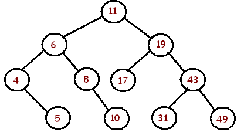

### Terminology
 * **Tree**: tree is a collection of nodes and edges that connect the nodes.
 * **Node**: node is the tree entity, it contains a value, and it may have a child node.
 * **Edge**: edge is the link between two nodes.
 * **Root**: root is the topmost node of the tree.
 * **Child**: child is a node that has a parent node
 * **Parent**: parent is a node that has an edget to a child node
 * **Leaf**: leaf is a node that doesn't have a child node
 * **Depth**: depth is the length of the path from the node to its root. root's depth is 0.
 * **Height**: height is the length of the longest path from the node to a leaf. leaf's height is 0.
 * **Binary Tree**: binary tree is a tree in which each node has at the most two children, i.e., left child and right child.
 * **Full binary tree**: full binary tree is a binary tree in which each node has either 0 or 2 children.
 * **Complete binary tree**: complete binary tree is a binary tree in which each level is completely filled, except possibly the last, and all nodes in the last level are as far left as possible.
 * **Perfect binary tree**: perfect binary tree is a binary tree in which every node has two children and all leaved have the same depth.
 * **Balanced binary tree**: balanced binary tree is a binary tree in which the left and right subtrees of every node differ in height by no more than 1.
 * **Binary search tree**: binary search tree is a binary tree in which every node is larger than all the nodes in the left subtree, and smaller than all the nodes in right subtree. 
 
 

 * **Depth-First Search(DFS)**: DFS is an algorithm for traversing or search a tree. It starts at the root and expolores as far as possible along each branch before backtracking. --- Wikipedia. For above tree, the DFS traversing result woulb be:  11 -> 6 -> 4 -> 5 -> 8 -> 10 -> 19 -> 17 -> 43 -> 31 -> 49. This is actually pre-order DFS.
 * **Pre-order DFS**:  Traversal sequence(Root, Left, Right)(11 -> 6 -> 4 -> 5 -> 8 -> 10 -> 19 -> 17 -> 43 -> 31 -> 49)
 * **In-order DFS**: Traversal sequence(Left, Root, Right) (4 -> 5 -> 6 -> 8 -> 10 -> 11 -> 17 -> 19 -> 31 -> 43 -> 49)
 * **Post-order DFS**: Traversal sequence(Left, Right, Root)(5 -> 4 -> 10 -> 8 -> 6 -> 17 -> 31 -> 49 -> 43 -> 19 -> 11)
 * **Breadth-First Search(BFS)**: BFS is an algorithm for traversing or searching a tree. It starts at the root and explores the neighbor nodes first, before moving to the next level neighbors. --- Wikipedia. For above tree, the BFS traversing result woulb be: 11 -> 6 -> 19 -> 4 -> 8 -> 17 -> 43 -> 5 -> 10 -> 31 -> 49.

### binary search tree implementation in java
TreeNode.java
```
package com.rain.leetcode.tree;

public class TreeNode<AnyType> {
  public AnyType element;
  public TreeNode<AnyType> left;
  public TreeNode<AnyType> right;

  public TreeNode(AnyType element){
    this.element = element;
    left = null;
    right = null;
  }
}
```

BST.java
```
package com.rain.leetcode.tree;

public class BST<AnyType extends Comparable<? super AnyType>> {
  private TreeNode<AnyType> root;

  public void makeEmpty(){
    root = null;
  }

  public TreeNode<AnyType> getRoot(){
    return root;
  }

  public boolean contains(AnyType element){
    return contains(element, root);
  }

  private boolean contains(AnyType element, TreeNode<AnyType> node){
    if (node == null)
    {
      return false;
    }
    int compareResult = element.compareTo(node.element);
    if (compareResult < 0){
      return contains(element, node.left);
    } else if (compareResult > 0){
      return contains(element, node.right);
    } else {
      return true;
    }
  }

  public void insert(AnyType element){
    root = insert(element, root);
  }

  private TreeNode<AnyType> insert(AnyType element, TreeNode<AnyType> node){
    if (node == null){
      root = new TreeNode<>(element);
      return root;
    }
    int compareResult = element.compareTo(node.element);
    if (compareResult < 0) {
      node.left = insert(element, node.left);
    }
    else if (compareResult > 0){
      node.right = insert(element, node.right);
    }
    return node;
  }

  private TreeNode<AnyType> findMin(TreeNode<AnyType> node){
    if (node == null){
      return null;
    } else if (node.left == null){
      return node;
    }
    return findMin(node.left);
  }

  private TreeNode<AnyType> findMax(TreeNode<AnyType> node){
    if (node == null){
      return null;
    } else if (node.right == null){
      return node;
    }
    return findMax(node.right);
  }

  public void remove(AnyType element){
    remove(element, root);
  }

  private TreeNode<AnyType> remove(AnyType element, TreeNode<AnyType> node){
    if (node == null)
      return node;

    int compareResult = element.compareTo(node.element);
    if (compareResult < 0){
      node.left = remove(element, node.left);
    } else if(compareResult > 0){
      node.right = remove(element, node.right);
    } else if (node.left != null && node.right != null){
      node.element = findMin(node.right).element;
      node.right = remove(node.element, node.right);
    } else {
      node = (node.left != null) ? node.left : node.right;
    }
    return node;
  }

  public void preOrder(TreeNode<AnyType> node){
    if (node == null){
      return;
    }
    System.out.println(node.element);
    preOrder(node.left);
    preOrder(node.right);
  }

  public void inOrder(TreeNode<AnyType> node){
    if (node == null){
      return;
    }
    inOrder(node.left);
    System.out.println(node.element);
    inOrder(node.right);
  }

  public void postOrder(TreeNode<AnyType> node){
    if (node == null){
      return;
    }
    postOrder(node.left);
    postOrder(node.right);
    System.out.println(node.element);
  }

  public void printTree(){
    if (root == null){
      System.out.println("This tree is empty");
    } else{
      inOrder(root);
    }
  }

  public static void main(String[] args) {
    BST<String> binarySearchTree = new BST<String>();
    binarySearchTree.makeEmpty();

    binarySearchTree.insert("Hello");
    binarySearchTree.insert("World");
    binarySearchTree.insert("Rain");
    binarySearchTree.insert("Yalye");
    binarySearchTree.insert("OpenSource");
    binarySearchTree.printTree();
    binarySearchTree.remove("Rain");
    binarySearchTree.printTree();
  }

}

```

### tree usage


