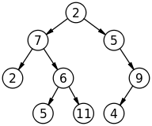

### Terminology
 * Tree: tree is a collection of nodes and edges that connect the nodes.
 * Node: node is the tree entity, it contains a value, and it may have a child node.
 * Edge: edge is the link between two nodes.
 * Root: root is the topmost node of the tree.
 * Child: child is a node that has a parent node
 * Parent: parent is a node that has an edget to a child node
 * Leaf: leaf is a node that doesn't have a child node
 * Depth: depth is the length of the path from the node to its root. root's depth is 0.
 * Height: height is the length of the longest path from the node to a leaf. leaf's height is 0.
 * Binary Tree: binary tree is a tree in which each node has at the most two children, i.e., left child and right child.
 * Full binary tree: full binary tree is a binary tree in which each node has either 0 or 2 children.
 * Complete binary tree: complete binary tree is a binary tree in which each level is completely filled, except possibly the last, and all nodes in the last level are as far left as possible.
 * Perfect binary tree: perfect binary tree is a binary tree in which every node has two children and all leaved have the same depth.
 * Balanced binary tree: balanced binary tree is a binary tree in which the left and right subtrees of every node differ in height by no more than 1.
 * Binary search tree: binary search tree is a binary tree in which every node is larger than all the nodes in the left subtree, and smaller than all the nodes in right subtree.
 
 * 

### tree implementation
java version including traversal

### tree usage

