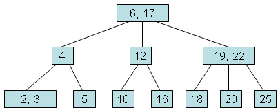

### What's is B-Tree?
In computer science, a B-tree is a self-balancing tree data structure that maintains sorted data and allows searches, sequential access, insertions, and deletetions in logarithmic time. B-tree is similar to a binary search tree, but in a B-tree a node can have more than two children.  By the way, there's no standard about what the B in B-Tree means.

### B-Tree's rule
According to Knuth's definition, suppose we have a B-tree of order `m`, it satisfies the following properties:
 * Every node has at most `m` children.
 * Every Internal node (non-leaf and non-root) has at least `⌈m/2⌉` child nodes.
 * The root has at least two children if it's not a leaf node.
 * A non-leaf node with `k` children contains `k - 1` keys.
 * All leaves are at the same level.
B-tree is a generalization of a 2-3 tree which is a B-tree of order 3.
Let's describe a B-tree's variable in a more normal way, if a B-tree has `minimum degree` of `n`, for 2-3 tree, `n` is 2. the `minimum degree` is often determined by disk block size.
 * Every node except root must contain at least `n-1` keys.
 * All nodes may contain at most `2n - 1` keys.
 * Number of children of a node is equal to the number of keys in it plus 1.
Also, all keys of a node in B-tree are sorted in increasing order, the child between two keys `k1` and `k2` contains all keys in the range from `k1` and `k2`.

### Algorithm
#### Search
Searching is similar to searching a BST, starting from the root, recursively search the target from top to bottom. suppose the current node has `n` keys, according to the rule, the node must has `n+1` children seperated averagely by the keys of the current node. 

#### Insertion
All insertions start at a leaf node. Inserting a new element starting from searching for a leaf node that the new one should be added, then we may encounter the following situations
 * the node is not full ( it's size less than the maximum key-limit). Just insert the new element into the node, keeping the node's elements ordered.
 * the node is full. The node would be split into two nodes. we will choose a single median and insert it to the node's parent, and the keys left will be split into two nodes. the newly added parent node may make the parent node full and the parent node should be split, and so on.

#### Deletion
 * If the key to delete is in a leaf node, delete it, if after deleting, the node's size is under the minimum number rule of the B-tree, we rebalance the tree.
 * If the key to delete is in an internal node, we will choose a new separator(either the largest element in the left subtree or the smallest element is the right subtree), remove it from the subtree, and replace the deleted key with it. If after deleting the new separator from a subtree, the subtree's size is under the minimum number rule of the B-tree, we rebalance the tree.
 * rebalancing after deletion runs from a leaf to the root, mainly use the rotation method.

### B-Tree's implementation
phishman3579 gives a wonderful java implementation. https://github.com/phishman3579/java-algorithms-implementation/blob/master/src/com/jwetherell/algorithms/data_structures/BTree.java

### B-Tree's Usage
B-Tree is well suited for storage systems that read and write relatively large blocks of data. It's commonly used in databases and file systems, mainly aimed for reducing the number of accesses to the disk.

### References
[busying-oneself-with-b-trees](https://medium.com/basecs/busying-oneself-with-b-trees-78bbf10522e7) Vaidehi Joshi
[B-tree wiki](https://en.wikipedia.org/wiki/B-tree) wikipedia
[BTree visualization](https://www.cs.usfca.edu/~galles/visualization/BTree.html) Professor David Galles

