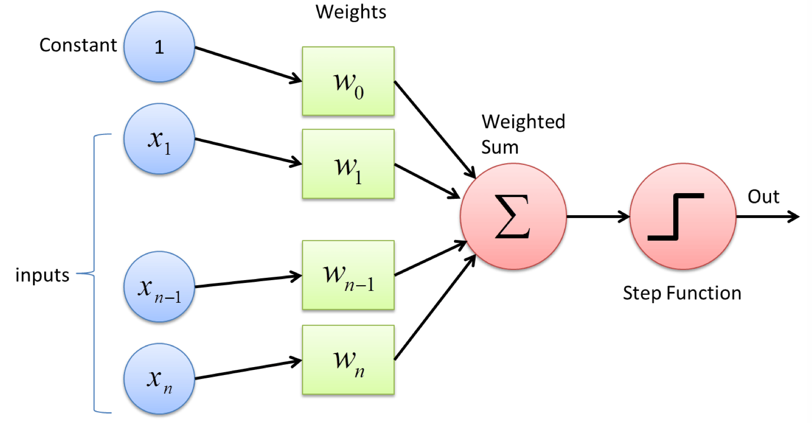

### What is Perceptron?
Perceptron is a single layer neural network.

all the input `$x$` are multiplied with their weights `$w$`, then add all the multiplied values, the result is called **Weighted Sum**, finally the sum is applied to the **Activation Function**(such as sigmoid function)
the solution to the `$w$` is `$w _ { i } \leftarrow w _ { i } + \Delta w _ { i }$`, and `$\Delta w _ { i }$` is `$ \eta ( y - \hat { y } ) x _ { i }$`


### Code from scratch

```
# -*- coding: utf-8 -*-
"""
-------------------------------------------------
   File Name：     perceptron
   Description :   
   Author :        Yalye
   date：          2018/12/31
-------------------------------------------------
"""

import numpy as np

class Perceptron():

    def __init__(self, num_of_inputs, epochs=100, learning_rate=0.01):
        self.weights = np.zeros(num_of_inputs + 1)
        self.epochs = epochs
        self.learning_rate = learning_rate

    def predict(self, inputs):
        summation = np.dot(inputs, self.weights[1:]) + self.weights[0]
        if summation > 0:
            activiation = 1
        else:
            activiation = 0
        return activiation

    def train(self, training_inputs, labels):
        for _ in range(self.epochs):
            for inputs, label in zip(training_inputs, labels):
                prediction = self.predict(inputs)
                self.weights[1:] += self.learning_rate * (label - prediction) * inputs
                self.weights[0] += self.learning_rate * (label - prediction)

training_inputs = np.array([
    [-2, 4],
    [4, 1],
    [1, 6],
    [2, 4],
    [6, 2],
])

labels = np.array([-1, -1, 1, 1, 1])

perceptron = Perceptron(2)
perceptron.train(training_inputs, labels)

from matplotlib import pyplot as plt
for i, input in enumerate(training_inputs):
    if (i < 2):
        plt.scatter(input[0], input[1], marker='_')
    else:
        plt.scatter(input[0], input[1], marker='+')

plt.plot([-2, 6], [5,1])
plt.show()

print(perceptron.weights)
```


### Perceptron vs SVM
For linear seperable input: 
 * perceptron algorithm will find more than one separating line, and the exact line obtained through a run of the the perceptron algorithm depends on the learing process and variables. and for svm, there is only one seperating-line.
 * perceptron is an online algorithm, it can process the data points one by one. On the other hand, SVM needs all the training data before the classifier building start.
 * SVM finds the largest margin, which will help you classify the test data better.